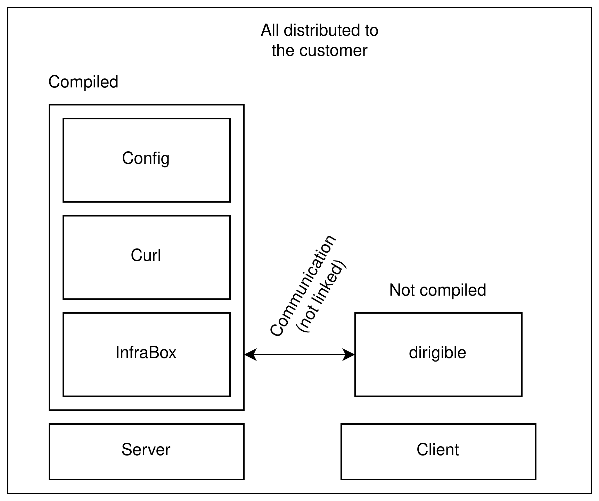

# Day 2 Practical Exercise - Open Source Compliance

You work for **Company G** and have been tasked with verifying the compliance for your new project. This GitHub repository contains multiple open source 'modules'. When combined and installed, these modules produce the 'product'. Review the compliance information of these modules and any relevant install scripts, and determine a suitable out-licence for the product (if such a licence exists)...

## Further exercise info

Someone has already started the compliance work. They ran scancode on the third-party modules. You can view `results.csv` and `results.json` for summaries of the scan.

Here's a sketch of the architecture:

There are four modules, what are *their* out-licence(s)? I.e., the out-licence of module 1, is an in-licence for the product.

Ignore the licence of: this readme, the branding logo, the architecture diagram, and the scancode results. 

Use any automated compliance tooling at your disposal to review the licences. For example: Command line tools, spreadsheet software. Or just browse the source code!

> Instructor's note: This task is designed in such a way that you *will* encounter problems. There are areas on your worksheets where you should describe these problems to be discussed in the Q&A session.

